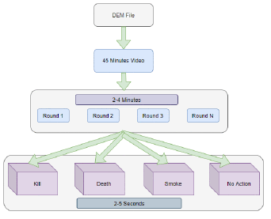
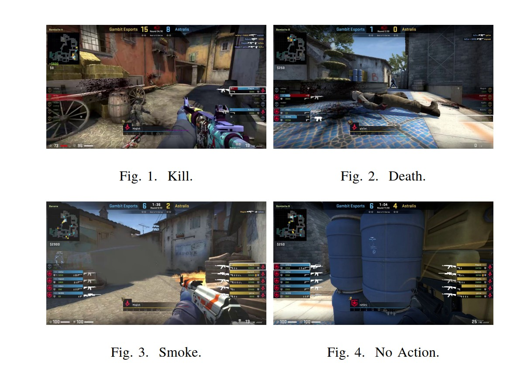
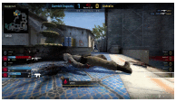
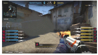
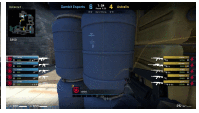
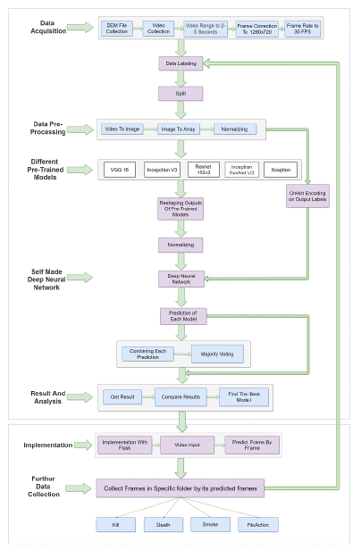
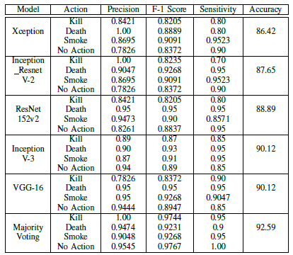
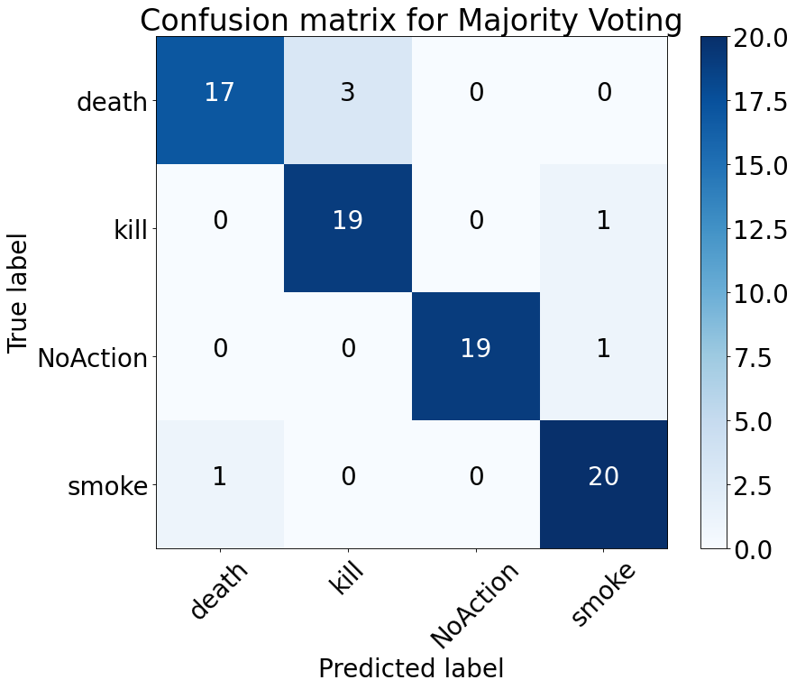

# Action Recognition of CS:GO Counter-Strike

Detect and classify in-game actions in Counter-Strike: Global Offensive using machine learning.
Unlock insights into gameplay dynamics and strategic decision-making.


## 📋 Table of Contents

- [About](#about)
- [Features](#features)
- [Method](#method)
- [Result](#result)
- [Quick Start](#quick-start)
- [Installation](#installation)
- [Project Structure](#project-structure)
- [Associated Publication](#associated-publication)
- [Contributing](#contributing)
- [Support](#support)
- [Acknowledgments](#acknowledgments)

## About

This project focuses on real-time action recognition in Counter Strike: Global Offensive. The system identifies four key in-game events — kill, death, smoke, and no action — using multiple deep learning architectures. Five transfer learning models (VGG16, Xception, InceptionV3, Inception-ResNet-V2, ResNet152-V2) are evaluated alongside a custom neural network to determine the best performer.

The pipeline is designed to classify actions frame by frame, support real-time inference, and generate structured outputs for downstream prediction models. It also includes an automated module for collecting and processing gameplay video, making it easier to scale datasets and measure action frequency across matches.

This work demonstrates a practical framework for gameplay analytics, player performance assessment, and early-stage prediction of match dynamics using advanced computer vision techniques.

## Features

- 🎯 **Action Recognition**: Identifies key actions performed by players in CS:GO, such as shooting, reloading, jumping, and planting/defusing the bomb.
- ⚡ **Performance**: Utilizes efficient data processing techniques to handle large datasets from CS:GO demo files.
- 🛠️ **Extensible**: Designed to be easily extended with new actions and data sources.
- 📊 **Data Analysis**: Provides tools for analyzing gameplay data and extracting meaningful insights.
- 🤖 **Machine Learning**: Employs machine learning algorithms to train models for action recognition.

## Data

Data were collected as DEM formatted files, which are game files and only playable by the  CS: GO game

#### Data acquisition


#### Example input








## Method

#### System model


## Result

### Model performance


### Confusion Matrix


## Quick Start

Clone the repository and open the Jupyter Notebook:

```bash
git clone https://github.com/Abrar-Islam-Oitijjho/Action-Recognition-of-CSGO-Counter-Strike.git
cd Action-Recognition-of-CSGO-Counter-Strike
pip install -r requirements.txt
jupyter notebook Retinal-OCT-Disease-Classification.ipynb
```

Follow the instructions within the notebook to train and evaluate the model.

## Installation

### Prerequisites
- Python 3.7+
- Jupyter Notebook
- Pandas
- NumPy
- Scikit-learn (optional, for model training)
- TensorFlow/Keras (for deep learning models)

## Project Structure

```
Action-Recognition-of-CSGO-Counter-Strike/
├── data/                                   # CS:GO demo data
├── assets/                                 # Contains screeshots
├── tools/                                  # Helper files to the main notebook
├── 3 features action recognition.ipynb     # Main file with 3 features
├── 4 features action recognition.ipynb     # Main file with 4 features
├── 📄 requirements.txt                     # Python dependencies    
└── 📄 README.md                            # This file

```

## Associated Publication

[Action Recognition using Transfer Learning and Majority Voting for CSGO](https://ieeexplore.ieee.org/abstract/document/9608407)

## Contributing

Contributions are welcome!

### Quick Contribution Steps
1. 🍴 Fork the repository
2. 🌟 Create your feature branch (`git checkout -b feature/AmazingFeature`)
3. ✅ Commit your changes (`git commit -m 'Add some AmazingFeature'`)
4. 📤 Push to the branch (`git push origin feature/AmazingFeature`)
5. 🔃 Open a Pull Request


### Support

- 📧 **Email**: abraroitijjho35@gmail.com
- 🐛 **Issues**: [GitHub Issues](https://github.com/Abrar-Islam-Oitijjho/ARIMA-Modeling-on-EEG-Time-Series-Data/issues)

## Acknowledgments

🌟 Special thanks: to the co-authors of this paper.
